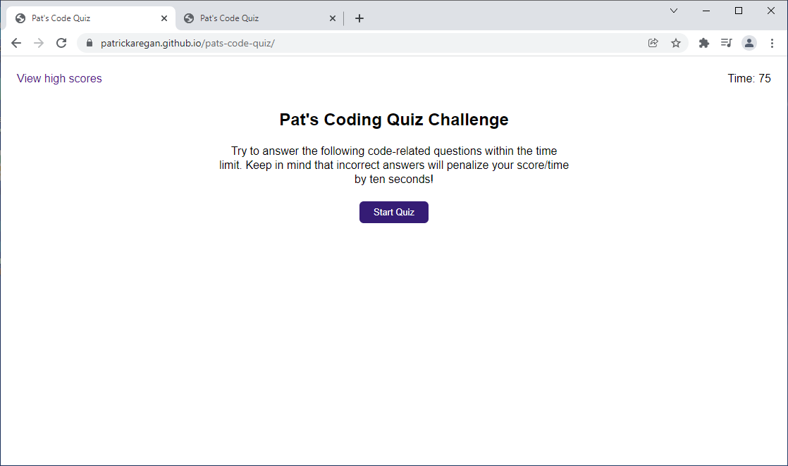

# patrickaregan.github.io/pats-code-quiz
Pat's Code Quiz

## Description
- This project is a coding quiz built with HTML, CSS and JavaScript.
- When the user starts the quiz the first question is presented and a timer starts with 75 seconds.
- The timer ticks down every second and when the user gets a question wrong it subtracts 10 seconds.
- There are five questions and each is worth 20 points.
- When the users reaches the last question their points are added up and they can enter their initials and submit their score to the High Scores, which are saved in local storage.
- If the timer gets to zero before the last question the quiz is over and the user just has to accept whatever points they have at that time and they can submit their initials.
- It was great making this code quiz because I may have to take one in an interview in the future. Not all of the questions in my quiz are related to coding but the point is to learn about HTML/CSS/JavaScript in the process of making the quiz. Also to be prepared for a timed coding quiz if I ever have to take one for a job.
- In coding bootcamp I learned two things that helped me complete this project:
- The first was about local storage and saving objects to it using JSON.stringify. I used it to save the high scores. When the end of the game is reached I populate a high score object with the initials and score, then push that into a high scores array and then store that array in local storage. When the quiz starts I have to get that high scores data from local storage (if any exists), parse it and store it in an array of high score objects so I can append the next set of high scores to it. I also have to sort the high scores array and reverse it so the highest scores are on top. Fortunately JavaScript has a way to sort arrays of objects by one of the object properties. 
- The second thing I learned about was setInterval. This javascript function lets you run a function every second, or whaterver interval you choose. This is how I implemented the timer. The function it calls decrements the timer counter, updates the HTML in the timer screen element and when the timer reaches zero it calls the gameOver function to end the game.

## Screenshot

## Link
[https://patrickaregan.github.io/pats-coding-quiz/](https://patrickaregan.github.io/pats-coding-quiz/)

